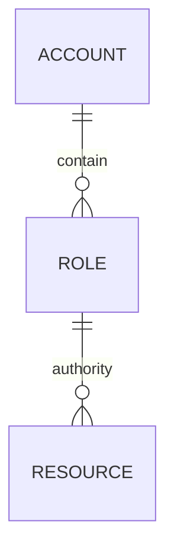

# 认证模块



资源分为多种类型，rest API 类型。后台管理员的菜单类型。用缓存提高访问效率，因为这个是每个API都会调用的，需要效率。

## 需求

用来进行客户端授权，第三方授权。采用OAuth2进行认证，将auth服务作为认证中心，gateway作为资源服务器，客户端或第三方作为客户端。做成一个spring cloud 服务，以接口的形式重复使用。

### 授权管理

可以设置不同角色的可访问资源，角色管理，授权管理.

### 获取账户信息及访问权限

GET /auth/authority/token&token=string&resource=string

resource为需要访问的资源

token为访问令牌

返回，账户信息

```json
{
	username:string,
	auth:boolean,
	id:long
}
```

### 客户端授权

客户端访问后端资源时，需要提供token作为访问令牌，token通过提交认证来获取。认证方式包括手机验证码，微信等，支持添加新的认证方式。采用spring sercurity 作为基础框架。

### 获取randomToken

用来注册的时候加密用户密码

GET /auth/randomToken

#### 用户注册

POST /auth

```
{
	username:string,
	password:string
}
```

Password = MD5（passord + randomToken）

#### 用户密码登录

GET /auth?type=password&username=string&password=string

返回 登录token

#### 设备登录

GET /auth?type=device&deviceId=string

返回登录token

#### 验证码登录

GET /auth?type=code&phone=string&code=string

返回登录token

#### 其他方式

......

### 第三方授权

第三方授权采用MD5验证签名的方式，每个请求中，需要加上time时间戳字段，用请求中的参数与time进行MD5+token进行签名验证。采用商户号的方式新增第三方。

/auth/authority/md5&sign=string&merchantId=long

```json
[
	{
		name: string,
		value: string
	}
]
```

